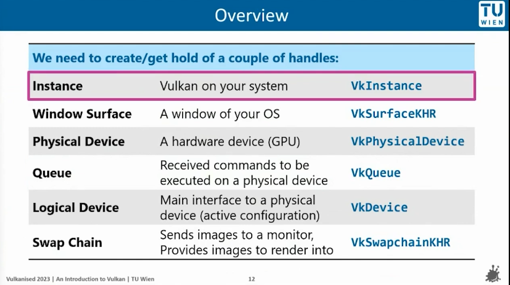

[chapter 1  code](https://github.com/junyiwuu/vulkanEngine/tree/00a8953686fdff02c80504df77a1088ce2ec82bf)

[Vulkan Engine tutorial](https://youtube.com/playlist?list=PL8327DO66nu9qYVKLDmdLW_84-yE4auCR&si=RmYj1OuZB_rt8zqs)

### Overview notes:

FirstApp : initialize the window, initialize the graphicPipeline(read SPRV files into buffers)


  




  
  
  
  

## Chapter 2 : read spv and build pipeline

[chapter 2 code](https://github.com/junyiwuu/vulkanEngine/tree/b54ca5d99010c94e903fa41f704188dc7adc9ae1)

----------------------------
pipeline build

std::vector
dynamic sized array

`static std::vector<char> readFile(const std::string& filepath);` read file content and return with formate std::vector\<char>
## createGraphicPipeline

we read files into buffers.
```cpp
auto vertCode = readFile(vertFilepath);
auto fragCode = readFile(fragFilepath);
```


**lvePipeline constructor**

call createGraphicPiline function --> create buffers --> read files for buffers, store data into them.
**back to FirstApp**:

```cpp

namespace lve{

class FirstApp{
  public:
	static constexpr int width = 800;
	static constexpr int height = 600;
	

	void run();

   private:
		LveWindow LveWindow_app{width , height, "hello vulkan"} ;
		lvePipeline lvePipeline_app{"../shaders/simple_shader.vert.spv", "../shaders/simple_shader.frag.spv"};
};

}

```

add the lvePipeline in FirstApp private, so when initialize the object, it also get called
## Chapter 3:

[chapter 3 code](https://github.com/junyiwuu/vulkanEngine/tree/d52a0cd4cf65d366e987f077259bbd2d5749374b)

## Chapter 4:

[chapter 4 code](https://github.com/junyiwuu/vulkanEngine/tree/d282352785ff4ba909beed1d68cbaf0d96b6d935)


**VkViewport.minDepth:**

define the depth range used during rendering, which maps the clip-space z value (from the projection transformation) to the depth buffer.


**VkPipelineColorBlendStateCreateInfo**

**VkPipelineColorBlendAttachmentState** :

is used to define the blending configuration for a single color attachment.

- A framebuffer can contain multiple color attachments.

- for example when rendering to multiple render targets, each color attachment can have its own independent blending settings

  
  

**Framebuffer attachments**:

a memory location where renderinng pipeline outputs data.

These attachments are typically part of a framebuffer, is used in conjunction with a render pass

- color attachment

- depth attachment
  
Color blending. They are used to configure how graphic pipeline processes the colors of framebuffer attachments during rendering


ORDER:

1. VkGraphicsPipelineCreateInfo (top)

2. VkPipelineShaderStageCreateInfo (part of the above)


## Chapter 5:

  

**VkExtent2D**

When you need to create a swap chain or framebuffer, you will need to tell the size

> - It seems like just return width and height, whiy need to use this class?

This ensuresthe code type-safe, it clearly indicates that the returned values are vulkan-compatible dimensions, not arbitray integers

  

**Command Buffer**

`std::vector<VkCommandBuffer> commandBuffers` A container to hold Vulkan Command Buffers.

A command buffer that contains many functions, we call this command buffer, to execute bunch of functions

Record commands buffers once at initialization and the reuse for each frame.

  

Command Buffer lifecycle from the [tutorial](https://www.youtube.com/watch?v=_VOR6q3edig):

  


# Rotation 
(2.13)

how to build a homogeneous coordinates:
affine transform matrix
```cpp
struct TransformComponent{
	glm::vec3 translation{};
	glm::vec3 scale{1.f, 1.f, 1.f};
	glm::vec3 rotation;
	
	glm::mat4 mat4_transform() {
		auto transform = glm::translate(glm::mat4{1.f}, translation); 
		//use yxz rotation
		transform = glm::rotate(transform, rotation.y, {0.f, 1.f, 0.f});
		transform = glm::rotate(transform, rotation.x, {1.f, 0.f, 0.f});
		transform = glm::rotate(transform, rotation.z, {0.f, 0.f, 0.f});
		transform = glm::scale(transform, scale);
		return transform;
		}

};
```


When changing from 2D to 3D , also need to update the **VkVertexInputAttributeDescription**,   `attributeDescriptions[0].format = VK_FORMAT_R32G32B32_SFLOAT;`

from `VK_FORMAT_R32G32_SFLOAT` to `VK_FORMAT_R32G32B32_SFLOAT`


### Intrinsic & Extrinsic

Extrinsic: axis x y z of the original coordinate system are not moving.
The object is rotating, and the coordinate system remain fixed

Intrinsic: coordinate system moves with the moving body


**Extrinsic Interpret**: R = Y1 X2 Z3 , should interpret from right to left
**Intrinsic Interpret**: Reverse () interpret from left to right )

Translate into code: 
```cpp
  

struct TransformComponent{
	glm::vec3 translation{};
	glm::vec3 scale{1.f, 1.f, 1.f};
	glm::vec3 rotation;
	
	glm::mat4 mat4() {
		const float c3 = glm::cos(rotation.z);
		const float s3 = glm::sin(rotation.z);
		const float c2 = glm::cos(rotation.x);
		const float s2 = glm::sin(rotation.x);
		const float c1 = glm::cos(rotation.y);
		const float s1 = glm::sin(rotation.y);
- 
		return glm::mat4{
			{
			scale.x * (c1 * c3 + s1 * s2 * s3),
			scale.x * (c2 * s3),
			scale.x * (c1 * s2 * s3 - c3 * s1),
			0.0f,
			},
			{
			scale.y * (c3 * s1 * s2 - c1 * s3),
			scale.y * (c2 * c3),
			scale.y * (c1 * c3 * s2 + s1 * s3),
			0.0f,
			},
			{
			scale.z * (c2 * s1),
			scale.z * (-s2),
			scale.z * (c1 * c2),
			0.0f,
			},
			{translation.x , translation.y , translation.z, 1.0f} };
	}
};
```

> Notes: 
- Most common ways to represent rotations are Euler angles, Quaternions and axis angle.


# 2.14

how to transfer orthographic view volume into vulkan canonical view volume

1. first method
	1. translate the center c of near plane to origin
	2. scale matrix to size of canonical

numerator --> canonical view volume dimensions
denominator --> orthographic view volume


# chapter 13

in the lve_camera.cpp --> implementing orthographic projection and perspective projection
-->then use the camera in the simple_render_system

**resize window but not affecting model size**
`float aspect = lveRenderer.getAspectRatio();`
`camera.setOrthoProjection(-aspect, aspect, -1, 1, -1, 1);`
this under `glfwPollEvents()`, and it update live-time aspect all the time


`auto projectionView = camera.getProjection() * camera.getView();`

`camera.getProjection()` returns projectionMatrix
`camera.getView()` returns viewMatrix

in first_app.cpp, called 
`camera.setPerspProjection(glm::radians(50.f) , aspect, 0.1f, 10.f);`
then go back, it called
```cpp
void LveCamera::setPerspProjection(float fovy, float aspect, float near, float far){
assert( glm::abs(aspect - std::numeric_limits<float>::epsilon()) > 0.0f );
  
const float tanHalfFovy = tan(fovy / 2.f);
projectionMatrix = glm::mat4{0.0f};
projectionMatrix[0][0] = 1.f / (aspect*tanHalfFovy);
projectionMatrix[1][1] = 1.f / (tanHalfFovy);\
projectionMatrix[2][2] = far / (far-near);
projectionMatrix[3][2] = - (far*near) / (far-near);
projectionMatrix[2][3] = 1.f;
}
```
these changed/update the projectionMatrix private member
then in simple_render_system , we need to get projection view
`auto projectionView = camera.getProjection() * camera.getView();`
projection matrix * view matrix(cam matrix)

then update push constant
`push.transform = projectionView* obj.transform.mat4();`
actually change the objects' positions


# chapter 15

date and time library: `#include <chrono>`
Get the current time: `auto currentTime = std::chrono::high_resolution_clock::now();`

`float frameTime = std::chrono::duration<float, std::chrono::seconds::period>(newTime - currentTime).count();`
* `std::chrono::duration` : period define the time unit
* `std::chrono::seconds::period` --> we tell `duration` use seconds as the time unit 
* construct a duration object, use float as the representation type for the duration

* contains the elapsed time from the subtraction

---

## Chapter 18

1. **Definition of a Lambertian Surface:**  
    A Lambertian surface scatters incoming light uniformly in all directions. Its appearance doesn’t change with the viewer’s angle, meaning it’s "perfectly diffuse."
    
2. **Projected Area Effect:**  
    When light strikes a surface at an angle θ\theta from the normal, the effective area that intercepts the light is reduced by a factor of cos⁡θ\cos \theta. _In other words, as θ\theta increases, the same beam of light is spread over a larger area, decreasing the light intensity per unit area._
    
3. **Intensity and Reflected Light:**  
    The brightness or perceived color of the surface is directly related to the intensity of the reflected light. Since the amount of light incident on the surface is proportional to cos⁡θ\cos \theta, the reflected intensity (and therefore the color as perceived) is also proportional to cos⁡θ\cos \theta.
    
4. **Energy Conservation:**  
    Despite the change in local brightness due to the cosine factor, a Lambertian surface redistributes the reflected light uniformly over the hemisphere above it. This ensures that the total reflected energy is conserved, maintaining the diffuse, angle-independent appearance.
    

a * b = ||a|| * ||b|| * cos⁡θ
if a and b are normalized --> ||a|| = 1, ||b|| = 1
Then a * b = cos⁡θ = light intensity